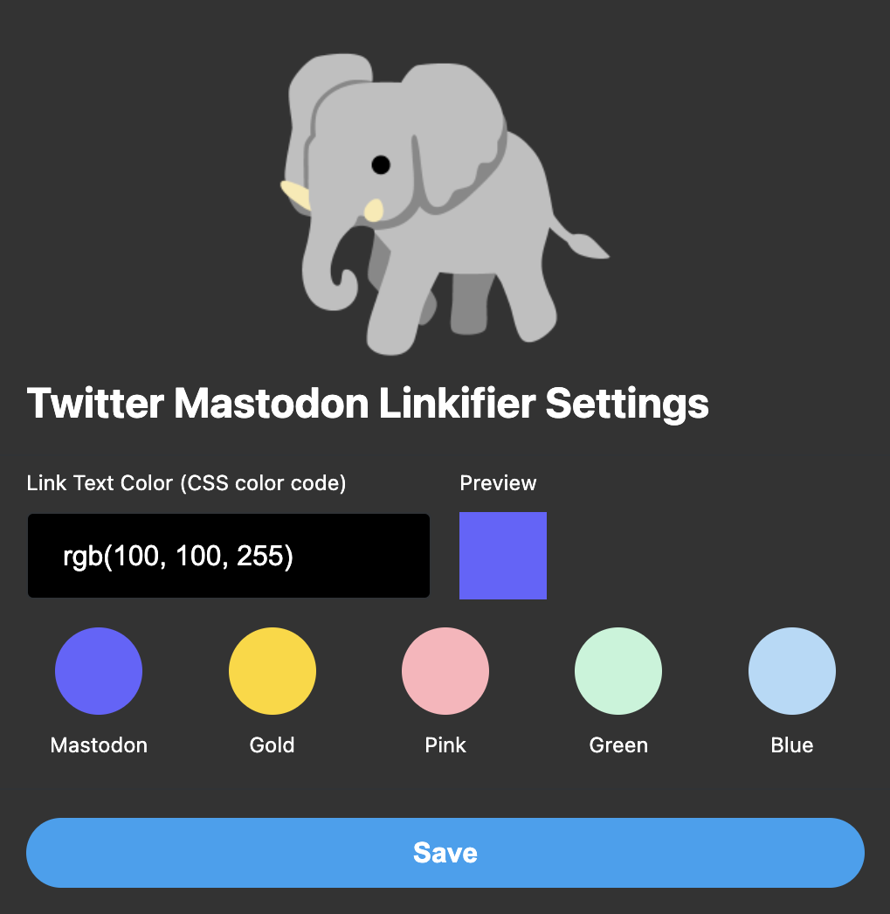
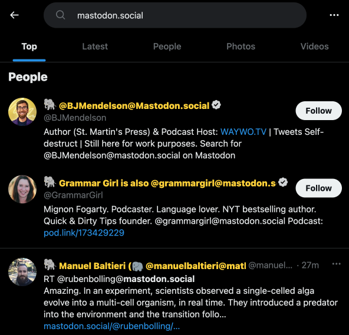
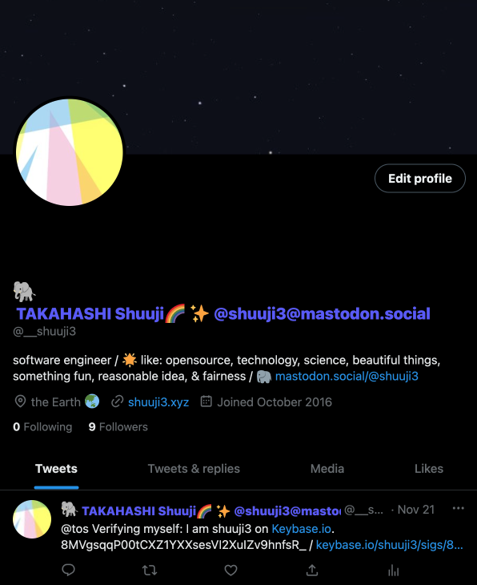

#  Twitter Mastodon Linkifier

Twitter Mastodon Linkifier makes Mastodon usernames (like `@username@mastodon.social`, `other-mastodon-server.social/@username`, etc.) into clickable links on [twitter.com](https://twitter.com) so that you can easily visit each Mastodon server without typing the name.

  

## Acknowledgement

The extension icon image was created from the elephant emoji of Google Noto Font: [assets/google-noto-emoji](assets/google-noto-emoji)

## How to install extension

### Google Chrome

[Twitter Mastodon Linkifier - Chrome Web Store](https://chrome.google.com/webstore/detail/twitter-mastodon-linkifie/cmbdalihhbnchjenkhnckmokhginmpfd)

### Mozilla Firefox

[Twitter Mastodon Linkifier – Get this Extension for 🦊 Firefox](https://addons.mozilla.org/firefox/addon/twitter-mastodon-linkifier/)

### Manual installation

You can also install the extension manually.

1. Toggle the "developer mode" button on the extentions page.

2. Click "Load unpacked" button.

3. Select the downloaded directory.

4. Enable the loaded extension.

